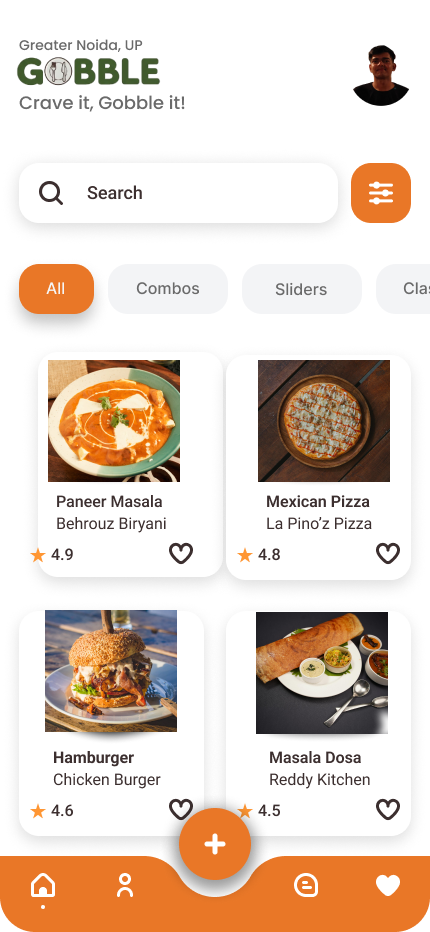
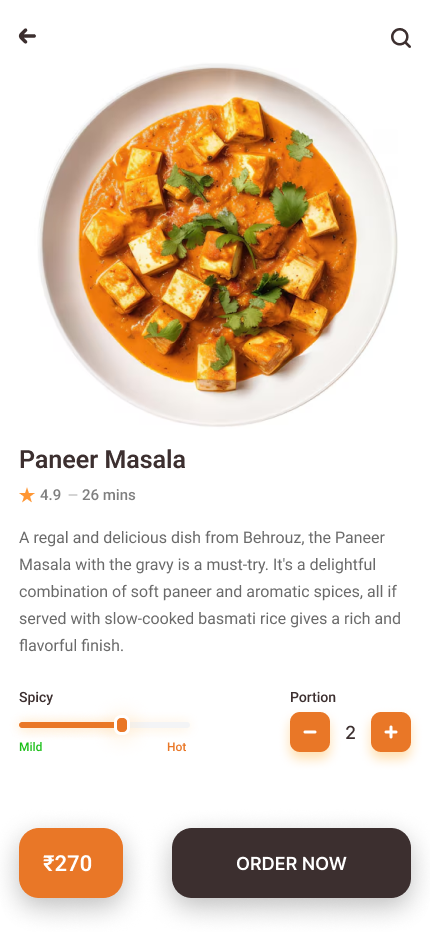
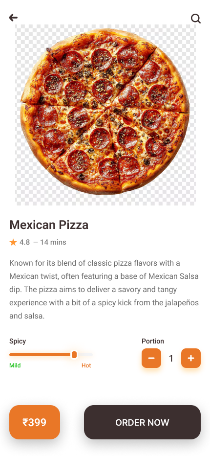
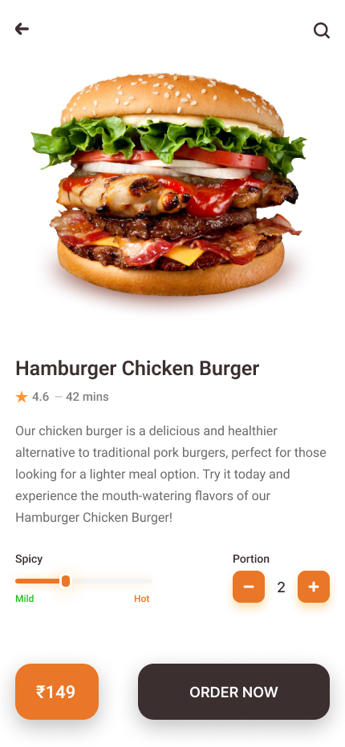
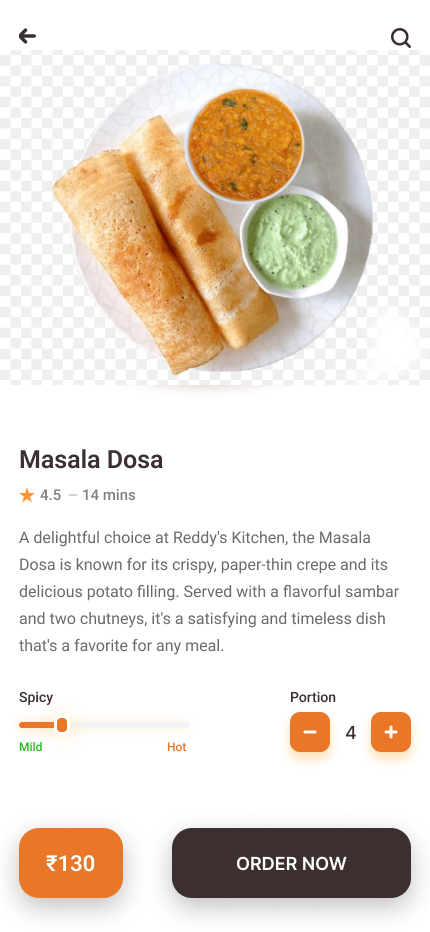
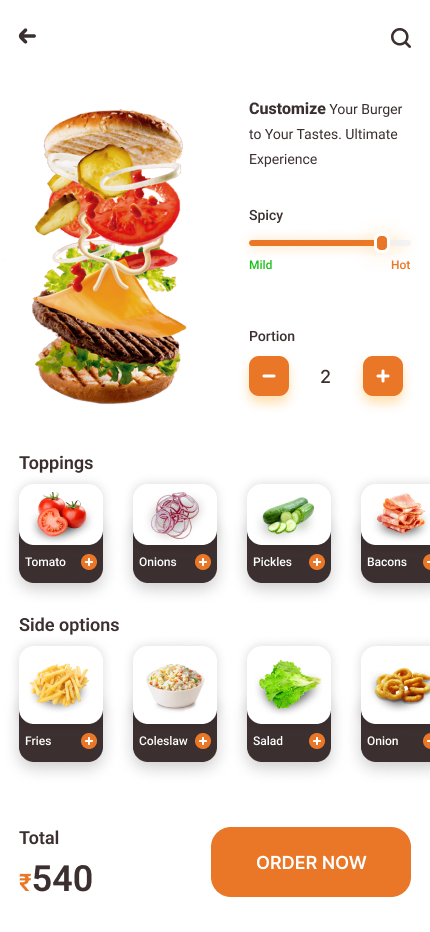
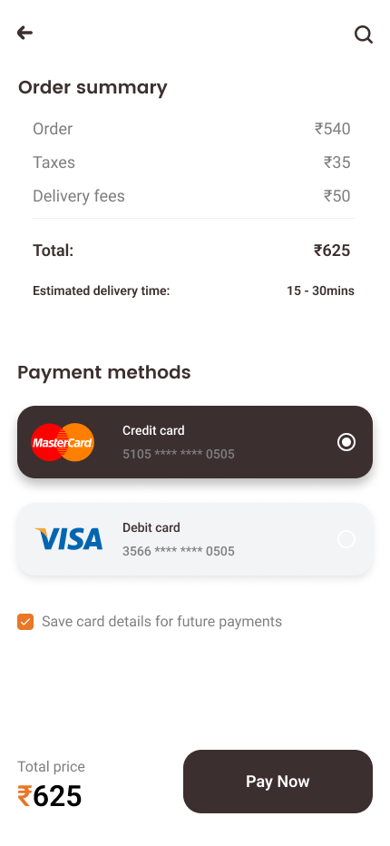

# 🍔 Gobble – Food Delivery App (UI/UX Design)

**Gobble** is a modern, vibrant, and appetizing food delivery app design that reimagines how users explore and order meals.  
From spicy Paneer Masala to cheesy Mexican Pizza, Gobble focuses on a clean, delightful, and fast ordering experience.

---

## 🎨 Features & Highlights

- 🧡 Splash Screen with appetizing food visuals  
- 🍱 Dynamic Home Screen with category browsing  
- 🍛 Detailed Dish Screens – Paneer, Pizza, Burger, Dosa  
- 🍔 Customization Page with ingredient selection (P5)  
- 💳 Smooth Payment Flow and Order Summary  
- ✅ Success Pop-up for completed orders  
- 👤 User Profile Management  
- 💬 Customer Support Chat Interface  

---

## 🌈 UI Preview

| Splash Screen | Home | Paneer | Pizza |
|----------------|------|--------|--------|
|  |  |  |  |

| Burger | Dosa | Customize | Payment |
|--------|------|------------|----------|
|  |  |  |  |

| Pop-up Message | User Profile | Customer Support |
|----------------|---------------|------------------|
|  |  |  |

---

## 🎨 Figma Design  
🖌️ Explore the full design here: [**Figma – Gobble App**](https://www.figma.com/design/kJWg1QdjCNq23q7VSAtltT/Gobble?node-id=0-1&t=w508WJM4BStEKBqy-1)

---

## 🔗 Connect with Me  

👨‍🎨 **Designed by:** [Takshay Kumar](https://www.linkedin.com/in/takshay-kumar-55a25525b?utm_source=share&utm_campaign=share_via&utm_content=profile&utm_medium=android_app)  
💻 **GitHub:** [takshaykr](https://github.com/takshaykr)

---

## 🧠 Tools Used
- **Figma** – UI/UX design  
- **Illustrator / Photoshop** – Asset enhancement  
- **Canva** – Layout refinements  

---

⭐ *If you like this design, don’t forget to give the repository a star!*
